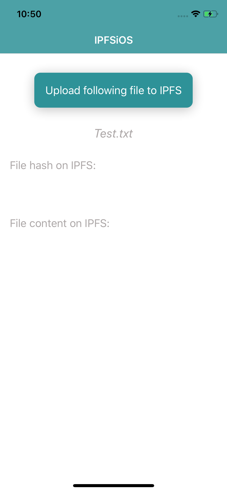
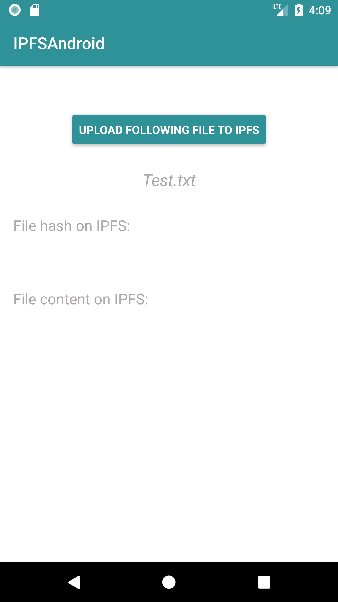
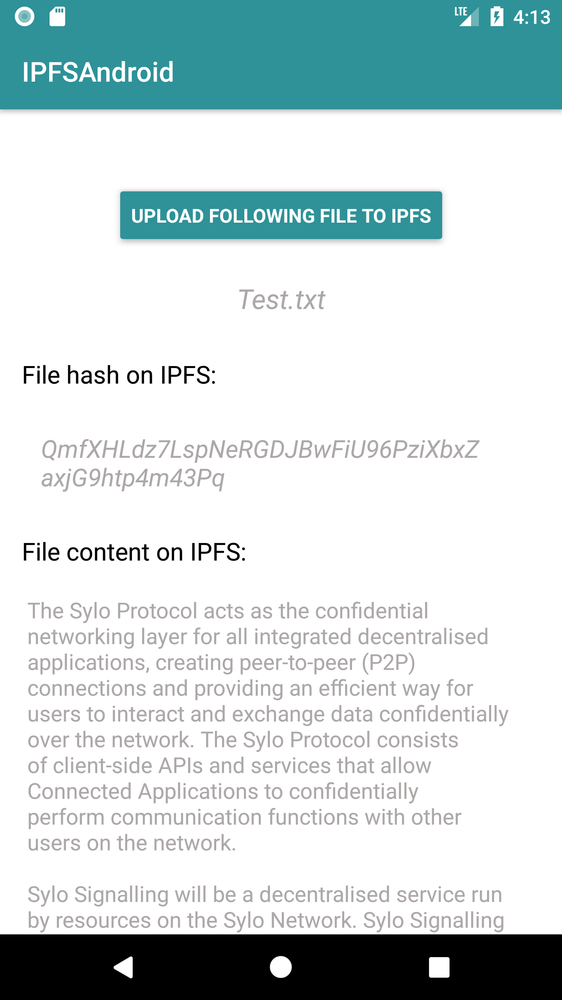
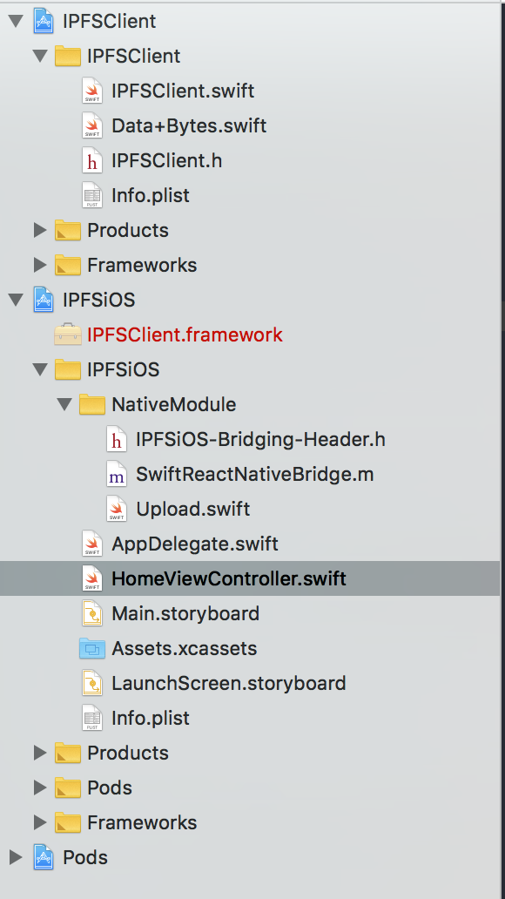
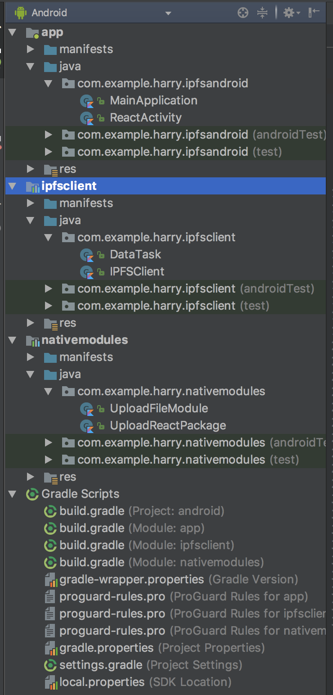

# IPFSNative     

This project implements one single file upload and display using the new hypermedia distribution protocol called [the InterPlanetary File System](https://github.com/ipfs/ipfs).

*IPFSNative* is a [ReactNative](https://github.com/facebook/react-native) project, and binding following two native libraries:  

* **ipfs-api-kotlin:** Provide API for kotlin to access a IPFS node via http.
* **swift-ipfs-api:** The Swift IPFS API shell/client is an asynchronous library that provides native calls to an IPFS node.

Tips from [Harry](https://harryyan.iceloof.com/):

>  The github address of installing Swift IPFS dependency is wrong in **swift-ipfs-api** repo. The correct line you need add to your `Cartfile` is `github "NeoTeo/swift-ipfs-api"` and then run this command in your terminal: `carthage update --platform iOS`.
> 
>
>  Similar issue happened to Android as well. When you add **ipfs-api-kotlin** dependency to gradle, please use following line: `implementation 'com.github.ligi:ipfs-api-kotlin:0.12'`, otherwise you can't install it. Don't forget to add Kotlin support in your module's gradle: `apply plugin: 'kotlin-android'`

## How to run this project

I don't checkin the **node_modules** folder to this repo, you need run `npm install` after you checkout this project.

Next, run `npm start` to start a package, and then run `ipfs daemon` to start IPFS Api Server.

### iOS

I don't include Carthage Build folder into version control because of the big size. So you need to run `carthage update --platform iOS` to install all **swift-ipfs-api** frameworks under `IPFSNative/IPFSNative/ios/IPFSiOS/IPFSClient` path.

Then open **IPFSiOS.xcworkspace** using Xcode(I'm using Xcode 9.4.1), choose `IPFSiOS` target and run it.

### Android

Open the project using Android Studio and click **Run** button to launch the app.

>  You can also run `react-native run-ios` or `react-native run-android` to lauch the app after you start IPFS Api Server. However, I don't recommend this way, because you have to specify iOS project path.

## ScreenShots

### iOS

	
	

 

### Android

	
	

## How to implement it

The main idea is to create independent framework(*iOS*) and modules(*Android*) on native sides, which is easy to maintain, migrate and extend.

Following picture is the iOS project hierarchy:

	

I created an **IPFSClient** framework, and add it to the main target(*WorkSpace*) called **IPFSiOS**. The main target doesn't need to know how to upload or fetch data from IPFS Api Server, it just cares about the response, and pass it to RN pages(*NativeModule* does it). Using this way, we can easily separate bussiness logic from UI logic, and easy to add more IPFS commands support without affecting other targets, also quite easy when migrating.

Android project has one more module called **nativemodules**(*communicate with IPFSClient*). Because the communication setup between android and React Native is more complicated than iOS, which needs more classes such as **UploadFileModule**, **UploadReactPackage**, and **MainApplication**. In this way, we can not only separate **IPFSClient** module, but also separate native service components, which means we can maintain this module as a SDK, and apply it to different projects.

	

# Issues I found:
The Swift and Kotlin IPFS Api Libraries are quite incompleted. For example, the command: `ipfs files ls`, which can list all the files user uploaded to the IPFS Server, but both Swift and Kotlin api don't support this command. This obstructs features implementation on both sides.

Also there are big differences between Swfit and Kotlin IPFS Api Library. For instance, Swift library provides `ls` functionality, which can show all files for specific component such as :

`ipfs file ls /ipfs/QmQLXHs7K98JNQdWrBB2cQLJahPhmupbDjRuH1b9ibmwVa`

However, there is no such functionality in Android Library. 

The both libraries don't provide error handling callback either. For example, we can't get any status when server not running or breaks down.

So finally, I just implemented the common function supported by both channels, that is, `add` and `cat`.