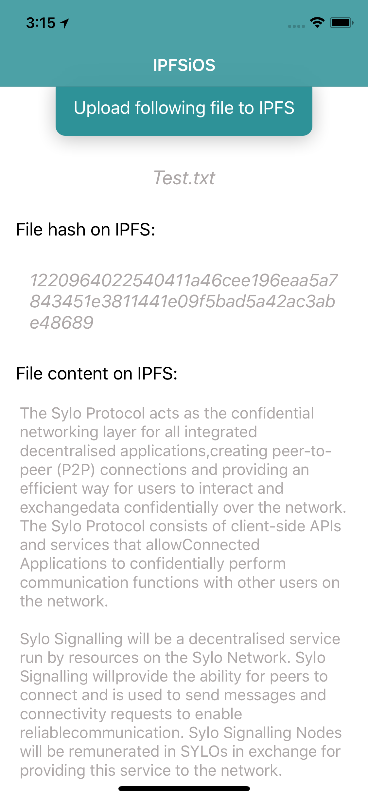
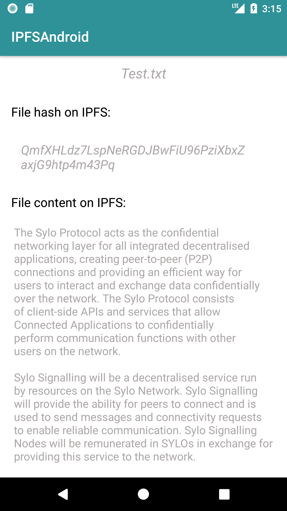

# IPFSNative     

This project implements one single file upload and display using the new hypermedia distribution protocol called [the InterPlanetary File System](https://github.com/ipfs/ipfs).

*IPFSNative* is a **ReactNative** project, and binding following two native libraries:  

* **ipfs-api-kotlin:** Provide API for kotlin to access a IPFS node via http.
* **swift-ipfs-api:** The Swift IPFS API shell/client is an asynchronous library that provides native calls to an IPFS node.

Tips from [Harry](https://harryyan.iceloof.com/):

>  The github address of installing Swift IPFS dependency is wrong in **swift-ipfs-api** repo. The correct line you need add to your `Cartfile` is `github "NeoTeo/swift-ipfs-api"` and then run this command in your terminal: `carthage update --platform iOS.`
> 
>
>  Similar issue happen to Android as well. When you add **ipfs-api-kotlin** dependency to gradle, please use following line: `implementation 'com.github.ligi:ipfs-api-kotlin:0.12'`, otherwise you can't install it. Don't forget add kotlin support in your module's gradle: `apply plugin: 'kotlin-android'`

### How to run this project

I don't checkin the **node_modules** folder to this repo, you need run `npm install` after you checkout this project.

Next, run `npm start` to start a package, and then run `ipfs daemon` to start IPFS Api Server.

Finally open Xcode or Android Studio IDE and click **Run** button to launch the app.

>  You can also run `react-native run-ios` or `react-native run-android` to lauch the app after you start IPFS Api Server.

### ScreenShots

#### iOS

 

#### Android

### How to implement it

# Credits:
Layout engine:

* [facebook/yoga](https://github.com/facebook/yoga)

In the Stylesheet Mod:

* [yaml/libyaml](https://github.com/yaml/libyaml)
* [nicklockwood/Expression](https://github.com/nicklockwood/Expression)
